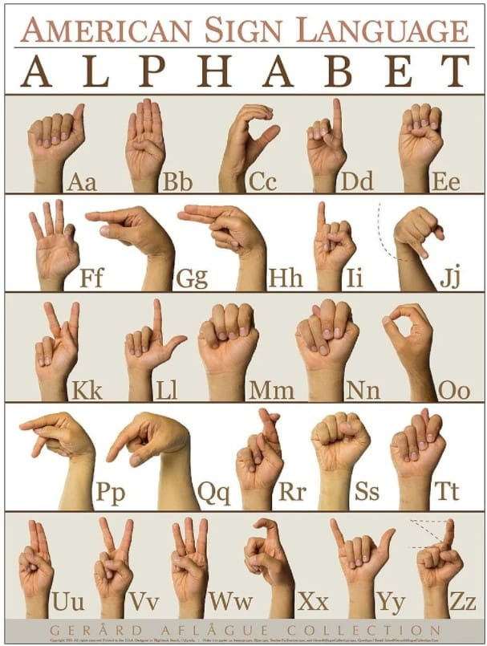
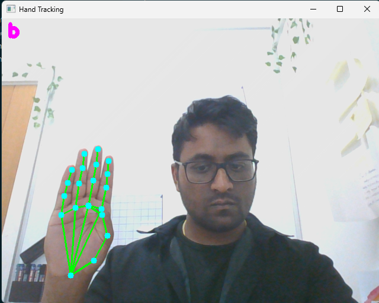
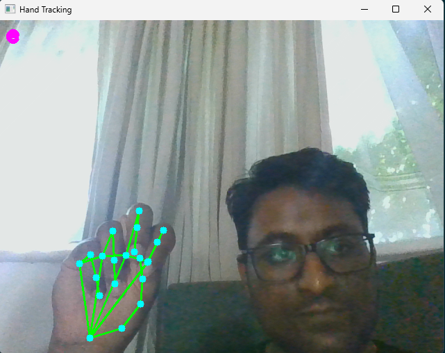

# ASL alphabet computer vision using Google's MediaPipe Landmarker

This project uses Google's pretrained landmarked hand recognising AI, to train a separate neural network trained on the ASL alphabet. This is then combined with a live webcam to display results in real time, using async threads & callback functions.

## MediaPipe, callbacks & live results
MediaPipe is a well documented & accurate model, the hand landmarks are very impressive and made this project feasible. The amount of data required to train these landmarkers is far beyond my means. The combination with OpenCV made this project much easier to diagnose issues visually. The livestream variation of MP is similar to frontend JSX React in that they both heavily rely on callback functions, which was an interesting challenge. The code could not wait to send and receive the model's prediction. Therefore it requires threading to allow for uninterrupted webcam with live results.

## How to run
1) Install dependencies:
```bash
     pip install -r requirements.txt
```
2) Download hand_landmarker.task from the MediaPipe docs and place it in the project folder

3) Collect training data by running data_collection.py — press a letter key to start collecting that letter, repeat for all letters or use my training data

4) Train and start the Flask server by running app.py

5) Run main.py to open the webcam and see live predictions

## Development diary (Version control with Git/GitHub)
01/07:
- First commit, first draft finished. I made the model with tensorflow & a flask API to connect to. I wrote a script to capture webcam screenshots corresponding to specific letters. I screenshotted every frame or every few to capture many different poses of the same letter. I recorded each letter, saving them to a separate file. I then wrote the main webcam script. I used the threading library to make a callback function which would send and wait for a response. This did require some extra checks for empty frames but allowed for constant live responses.

- This led to a very inaccurate model albeit free of technical bugs. The first and most obvious issue was Z & J,*(1. ASL alphabet)*, the letters involve movement in ASL. This does not work with my current framework. It takes a single image's landmarks and trains with that. It would need to be a couple consecutive frames. I did attempt to do the motion and screenshot throughout, labelling them Z & J. However, this meant many different gestures were labelled Z & J, which meant they would appear in a disproportonate number of results. I temporarily removed J & Z, this improved the accuracy.*(2. 1st commit - working)*

- Next issue was amount of data, originally I had around 100 sets of landmarks, for a model with 26 outputs this is just not enough data to learn. So i used prepare_dataset.py to increase the total to 5000 sets. I also repeated with slightly different gestures of the same letter, not just different frames to ensure more variety in the training data. As the landmarks would change with different people, due to signing styles and proportions of fingers, so I need prepare some data of other people signing. *(3. 1st commit - not working)*

## Screenshots:

1. ASL alphabet:


2. 1st commit - working:


3. 1st commit - not working: 


## Known limitations
 - Missing letters J & Z, currently not possible with current framework.
 - Inaccurate results
 - Only registers first hand in shot, not a problem for ASL alphabet but would be a problem with words or BSL. It would be a problem if multiple people signed at once as well. Google's landmarks include number of hands, so this is solvable.

## Future plans
- improve accuracy, better & more training data with more variety
- Once model is accurate enough, save model trained so it doesn't need to be retrained.
- Deploythe model to raspberry pi for portable camera